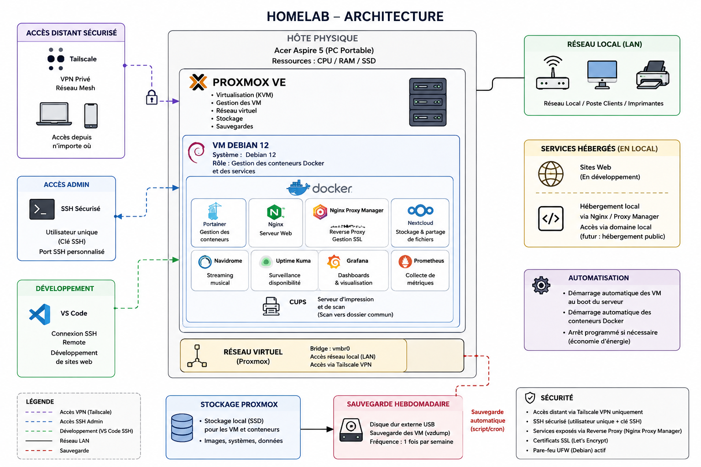
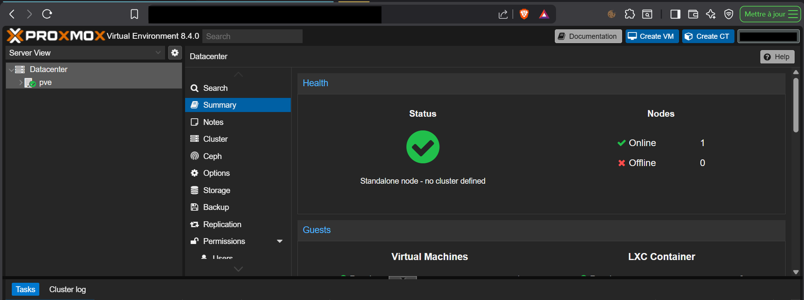
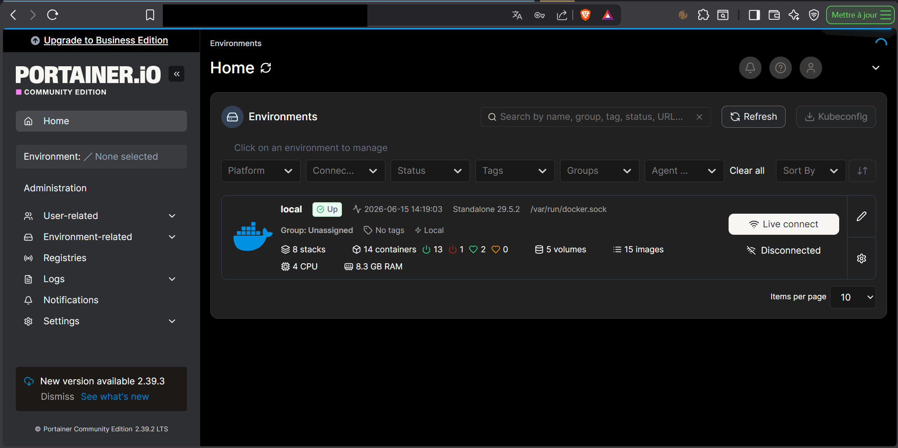

# 🖥️ Homelab Proxmox Infrastructure

## 📖 Présentation

Projet personnel réalisé dans le cadre de ma formation informatique.

Ce homelab est hébergé sur un ordinateur portable Acer Aspire 5 dédié à l'administration système, à la virtualisation et à l'hébergement de services.

L'objectif est de développer des compétences concrètes en administration Linux, virtualisation, supervision, sauvegarde et sécurisation d'infrastructures.

---

## 🏗️ Architecture

### Hôte physique

* Acer Aspire 5
* SSD local
* Proxmox VE

### Machine virtuelle principale

* Debian 12
* Hébergement des services Docker

---

## 🐳 Services déployés

| Service             | Fonction                                |
| ------------------- | --------------------------------------- |
| Portainer           | Gestion des conteneurs Docker           |
| Nginx               | Serveur Web                             |
| Nginx Proxy Manager | Reverse Proxy                           |
| Nextcloud           | Stockage et partage de fichiers         |
| Navidrome           | Streaming musical                       |
| Uptime Kuma         | Surveillance des services               |
| Grafana             | Visualisation des métriques             |
| Prometheus          | Collecte des métriques                  |
| CUPS                | Serveur d'impression et de numérisation |

---

## 🔒 Sécurité

* VPN Tailscale pour l'accès distant
* Administration SSH sécurisée
* Utilisateur dédié
* Reverse Proxy via Nginx Proxy Manager
* Services accessibles uniquement depuis le réseau autorisé

---

## 💾 Sauvegardes

* Sauvegarde automatique hebdomadaire des VM
* Stockage sur disque dur externe USB
* Vérification de l'intégrité des sauvegardes

---

## 📊 Supervision

La supervision de l'infrastructure est assurée par :

* Grafana
* Prometheus
* Uptime Kuma

Permettant le suivi de :

* Disponibilité des services
* Utilisation CPU
* Utilisation mémoire
* Utilisation stockage

---

## 🌐 Développement Web

* Développement de sites web hébergés localement
* Connexion distante via VS Code Remote SSH
* Préparation d'une future mise en production

---

## 🛠️ Compétences développées

* Administration Linux
* Virtualisation avec Proxmox VE
* Docker et conteneurisation
* Réseau TCP/IP
* VPN
* SSH
* Sauvegarde et restauration
* Supervision d'infrastructure
* Hébergement Web
* Gestion des services

---

## 🚀 Évolutions prévues

* Publication des sites web en production
* Mise en place de certificats SSL avancés
* Déploiement de services supplémentaires
* Renforcement de la supervision
* Automatisation des déploiements

## 👨‍💻 Auteur

Projet personnel réalisé dans le cadre de ma montée en compétences en administration systèmes et réseaux.
## 📸 Captures d'écran

### Tableau de bord Proxmox

### Gestion Docker avec Portainer

### Schéma d'architecture

